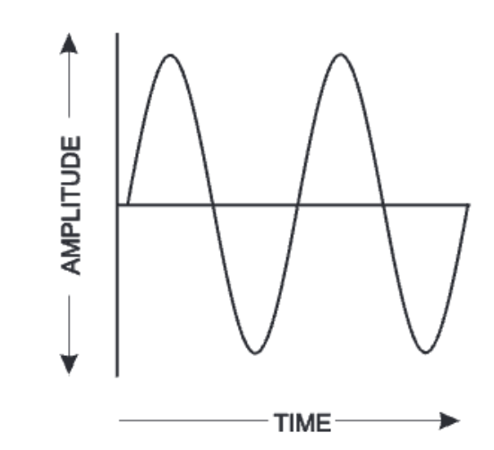

    

# What's my DB?
This application simply displays the current audio output’s dB level 
on the macOS toolbar.

## Background
### Recalling Sound Theory
Well, as we all know, the sound that we hear are a result of molecules in the air, that undergo 
compression & rarefraction.

### Storing audio samples

*The picture above is that of a sine wave, the simplest to understand, arguably.*

Let's look at a wave, it has a specific amplitude, which exhibits rarefaction, as the wave approaches the x-axis, it becomes more compressed.
Well, how do we store this analog signal inside a computer? Solution: [PCM Format](https://en.wikipedia.org/wiki/Pulse-code_modulation#:~:text=Pulse%2Dcode%20modulation%20(PCM),and%20other%20digital%20audio%20applications.).
An analog signal (like the sine wave stored above) is sampled at regular intervals. Usually, 44,100 times per second. You might
have seen 44.1KHz sampling rate ..... well this is what it is. So basically, the higher the sampling rate, the more "accurate" or well "clear"
the digital "translation" will be.

Once we get a sample, it will consist of a specific amplitude right. Like a sample could have multiple 0 radians or a 100 radians amplitude(s), so how do we differentiate between them ?
Well, we quantify it to a specific number. But this specific number has a particular range. Usually, this number can have 16, 24 or 32 bits. This
is known as bit-depth. So, once again, a higher bit depth means a more precise representation of amplitude. The PCM format is used by *wav*, *aiff* and many more formats. 

Also irl, sound waves are very complex, so the encoding algorithms are complex as well :) But the underlying idea remains more or less the same.

### Capturing an audio sample on macOS
The application uses [Core Audio framework](https://developer.apple.com/documentation/coreaudio/capturing-system-audio-with-core-audio-taps?language=objc) to capture 
incoming sample of audio. An Audio Tapper is a tool that allows one to intercept and capture real-time audio from the system’s audio output on a device (like a Mac). 
It works by tapping into the audio stream to collect data about the sound being played. 
The basic idea is to capture the audio output without modifying it, essentially allowing one to “listen in” on the system’s audio stream.

## Architecture
1. GetAudioDevice:
    - gets the audio device id
    - prints out some helpful information
2. AudioTapper:
    - Creates an Audio Tap object
    - Enables the object input 
    - Enables the Audio Tap object
3. AudioInfo:
   - The whole file basically retrieves the audio stream information
